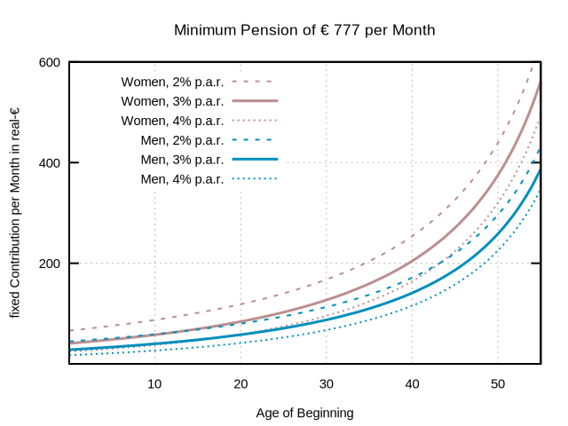
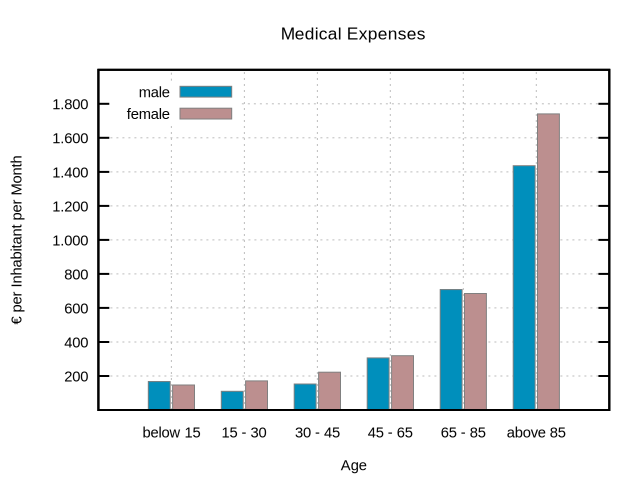
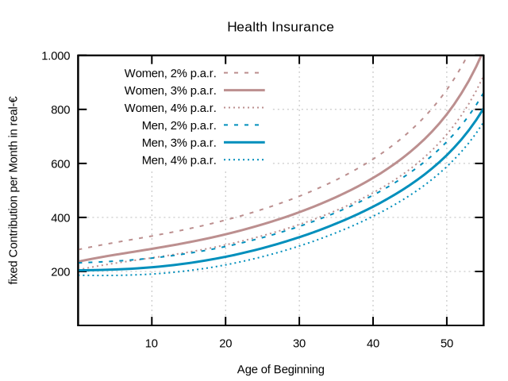

% Provident Fund
% FriendlySocieties.org
% 2018-12-28

Provident Fund
==============

*(no presentation, only first ideas)*

$~$

<big>The "Friendly Societies Provident Fund" is a decentralized self-governing social security system on mutuality and personal responsibility.</big>

$~$

[English](https://www.friendlysocieties.org/en/providentfund.html) – [Deutsch](https://www.friendlysocieties.org/de/providentfund.html)

#### Table of contents

  * [Preliminary remark and Motivation]
  * [Structure]
  * [1. Fundamentals of the Savings Plan]
  * [2. Fundamentals of the Insurance]
  * [3. Fundamentals of the Donation System]
  * [In a nutshell, the fine print in capital letters]
  * [Appendix]

# Preliminary remark and Motivation

The aim is to provide social security for residents without a state social security system.

The author has thought this as a draft proposal to members of the [North Bay Societies](https://www.northbaysocieties.org) ([Friendly Societies](https://www.friendlysocieties.org) / [Libertarian Societies](https://www.libertariansocieties.org)). It could also serve as a first basis for a general social security solution based on reciprocity and personal responsibility. If you are interested, we are looking forward to an exchange of ideas and cooperation ([contact](https://www.northbaysocieties.org)).

# Structure

The Friendly Societies Provident Fund consists of three modules: **Savings**, **Insurance**, and **Donations**:

  1. A **Savings Plan** for private wealth accumulation, e.g. for retirement income, unemployment or illness.
  2. **Mutual Insurance** according to the capital cover procedure for the areas of illness, accident, care, disability and, if applicable, death (widows and orphans).
  3. A voluntary **Donation System** for the poor and needy, as an alternative to state redistribution systems.

# 1. Fundamentals of the Savings Plan

Each participant continuously saves a **certain part of his income** in a **personal account**. This account can be maintained with the Provident Fund, but also with any other provider. The funds are **invested as capital** and the account has **distraint protection**. The aim is to build up private assets for:

  * Retirement Income
  * Income in the event of unemployment and illness
  * Personal aging reserve and deductible for health insurance

# 2. Fundamentals of the Insurance

The goal is a social security system that is **affordable for as many** participants as possible. In other words, only a **minimum level** of provision is sought.

This minimum care can also serve as basic coverage for individual care beyond this.

The insurance benefits serve to cover **financial risks** in the event of an emergency. They are **not** intended to be a common general expenditure budget. I.e. they come only with events starting from a certain size to carry (e.g. own costs of medical supply over x $ in sum within, for example, the last 12 months).

In the first step, the insurance only covers the areas of illness and accident.

For care, disability and death (widows and orphans), an insurance partner for group insurance or for discounted individual tariffs is initially sought.[^1]

Accumulation and major risks are covered by a reinsurance company.

## Health and Accident Insurance

The principle is similar to that of "[Homo Socialis](https://www.homosocialis.org)"[^2]; please read "[Concept](https://www.homosocialis.org/en/concept.html)" first.

The members are exclusively participants of the Provident Fund of the [Friendly Societies](https://www.friendlysocieties.org) or [Libertarian Societies](https://www.libertariansocieties.org), with the implementation as mutual health insurance instead of mutual assistance in emergencies. The privacy of the participants remains **strictly protected** by pseudonymizing the members and using the described "locked boxes". The described "financial pot" correspond to the coverage capital[^3] of the health insurance and are separated from the provision capital. The aging reserves remain with the participants (see below).  
The biggest difference to Homo Socialis is that the monthly contributions are not the same for all, but they adapt dynamically to the risk profile of their respective subgroups such as **age group and possibly gender**.

#### Incentives

*Excursus:* In the ideal case, the person who receives a product or service in trade is also the person who pays for that product or service. If, on the other hand, a third party has to bear the costs, this reduces the incentives to act efficiently. This should be countered in two ways.

This is achieved on one side by means of a **noticeable** proportionate (possibly regressive) **deductible** from their **own savings account** and another side by the fact that the participant/insurant are also the insurer/risk carrier. They are directly pro rata contributors and **owners** of the coverage capital and receive it back (not the provision capital) upon withdrawal/termination (possibly including investment income). At the same time, this allows relatively high means of safety/solvency without a competitive disadvantage.

As with "[Homo Socialis](https://www.homosocialis.org)", benefits in the event of damage are released or rejected by a small (each time newly, automatically and randomly formed) **jury of members**. This strengthens the perception of reciprocity, ownership and personal responsibility among the participants. At the same time, the type and scope of services can be adapted to the needs of the members. The jury may, by default or as the case may be, request the opinion of an expert (e.g. short opinion of a physician by e-mail who cooperates with the Provident Fund for such tasks or the like). As described above, the benefits are intended to cover financial risks and not general expenses, i.e. rather rare cases and not ordinary visits to the doctor.  
The approval process between the parties concerned and the jury is pseudonymized by both parties. It is ensured that no single member can assign the insured events to their members, but that this data is disclosed and assigned if a minimum number of members deems this necessary and demands it (see procedure such as "locked box" and jury at "[Homo Socialis](https://www.homosocialis.org)").

In order to **promote competition among healthcare providers** and to make prices transparent and comparable, members are encouraged to use comparison portals (if necessary, concrete ones).

#### Aging reserves

The insurance premiums to be paid always correspond to the actuarial risks, especially age. This results in lower premiums at an early age and **significantly higher** premiums at an advanced age (see appendix).

To compensate for this, each participant creates **their own** aging reserves in their personal savings account. The aging reserves are therefore **independent of the Provident Fund** and can be taken along if there is a change of provider.

#### Migration of the Healthy

Insurance claims and benefits are paid out of the actuarial coverage capital and also provisions capital for consequential costs are formed from this. A resigning member only receives his pro rata coverage capital back while provisions capital remain with the participants and are intended to cover damages that have already occurred. I.e. as a member I cannot avoid the payment of occurred damages by resignation.

Nevertheless, it will happen that a small group of rather sicker ("more expensive") people will become visible and form a permanent part of the running costs, i.e. the contribution amount.

Rational members would have to abandon the insurance and found new health insurance among themselves until the first sick group is established again and then continue henceforth...

I have the opportunity to leave a group in which some are constantly granted expensive luxury treatments in order to found new insurance with one another. It is unlikely, however, that then the other participants will grant me and others any luxury treatments. This could be suitable for everyone and form a new stable system.

I can also leave a group in which there are people with permanently bad illnesses and found new insurance with others who are still healthy like me. However, in this case, everyone in the new group will have to be skeptical of being left behind in case of illness too.

The balance is presumably reached when the running costs of the relatively sicker members are actually those benefits on which one is dependent in case of a fatality. An insurance group that is more expensive but proves that it also provides and manages the insurance that is important to me will be more attractive than a cheaper one which cannot.

A limitation to a minimum care (as demanded at the outset) is more likely to be close to such a balance.

Such a balance also requires that the premium level be close to the market price of the risk protection. If, for example, the level of contributions were uniform, even for groups which differ greatly in terms of risk (e.g. age, see appendix), then emigration/group formation would be both rational and stable.

The aging reserves ensure the balance between being young and old. A balance between rich and poor, favored or disadvantaged by life, etc., cannot be achieved through forced prices in a voluntary network but through voluntary solidarity, compassion, and charity (see donation system).

# 3. Fundamentals of the Donation System

Participants of the Provident Fund can donate into a charitable fund, which will benefit other participants who are in an emergency or have to struggle because of poverty.

Affected persons can send a request for help to a jury consisting of members of the Provident Fund who will decide on it.

Participation in the donation system is **voluntary**, but it is **considered decent** by members to donate **at least 4.6% of their annual personal expenses** to the benefit of the poorest (4.6% is only symbolic of the average devaluation of money[^4] of a year). Those who take part in this donation system receive a donation certificate and can show themselves as "voluntary solidarity members of their friendly society" in the presence of all other members. They can make this visible online and thus serve as role models for others. The donors are members of the Provident Fund of the Friendly Societies and a simple annual report of having donated at least 4.6% will suffice and this will **usually** neither be checked nor have to be proven.

The aim is that the voluntary donation fund is sufficient to help the poorest of the Provident Fund participants. The jury will send a message to all Provident Fund participants asking for help if this is not possible at a certain time within the donation fund.

The author believes in the natural solidarity of people. However, if members in need or poverty due to unfortunate living conditions suffer only from a lack of participation in donations, such members will suffer in the eyes of all and the idea of voluntary donations instead of state redistribution will have to turn out to be a Utopian idea.

# In a nutshell, the fine print in capital letters

An extensive savings discipline is necessary – noticeable deductible in case of damage – no guarantee or legal claim for benefits – nevertheless willingness to donate required – discussion with people and groups is necessary.

Participation in a community of [Friendly Societies](https://www.friendlysocieties.org) is not suitable for everyone.

# Appendix

## Outlook

If necessary, the first step with a small test group could even be carried out within just a few days and using only "paper and pen".

From the beginning, the project will work on including or cooperating with different groups of Friendly Societies, as well as on decentralizing and automating large parts by means of Smart Contracts (e.g. Bitcoin/RSK) and DAO, and possibly also utilizing Bitnation Pangea.

We would like to work together (where appropriate) on open Standards if other providers or projects develop similar Provident Funds.

## Feasibility

The guidelines below provide some ideas for assessing the feasibility of the above objectives.

#### Savings Plan and Returns

The success of a savings plan depends, among other things, on the four factors, 1. how much is saved on a regular basis, 2. more important, the returns generated, 3. much more important, how much time you have or how early you start, and 4. most important, being financially disciplined.

*Excursus:* The amount of the expected returns is uncertain and cannot be derived from past experience. A maximum range can be externally defined which is considered implausible.  
Jeremy Siegel, Professor of Finance at Wharton School, speaks in his book "Stocks for the Long Run" of a real return of 6.5-7% per annum over the last 200 years. However, this applies to an investment predominantly in the USA - that is when a country is selected during a period in which it has been able to develop into a world power orientation in many respects. A long-term real return of over 6.5% per annum can probably be considered implausible.  
William N. Goetzmann and Philippe Jorion of the Yale School of Management came to a median of 1.5% p.a. real return in the study "A Century of Global Stock Markets" in a comparison of 39 countries between 1920-1996. A long-term real return of over 1.5% p.a. can probably be considered plausible.  
The above examples concerned a pure equity investment, which will not be appropriate for every time horizon and not for every market valuation[^5]. At this point the concept of "The Permanent Portfolio" considered by Harry Browne and Craig Rowland, J. M. Lawson could be mentioned. This allows an investment policy that is largely independent of the economic situation and current market valuation, and which yielded a real return of 4.9% p.a. for the USA in the period 1972-2011.

A real yield of 2%, 3%, 4% p.a. is selected below for illustration purposes. All monetary units refer to the time of observation under consideration of currency devaluation.

#### Retirement income

*How much do I have to save for a minimum pension?*

An approximate estimate is based on the following: a target pension of € 777 per month[^6] – with continuously adjusted/increasing rates of paying-in and paying-out in accordance with the general price increase – start of pension at the age of 68 years[^7] – investment with a real yield of 2%, 3%, 4% – life expectancy of 77 (men) and 82 (women) years[^8].

Graphical lines do not show how much you have to save at any age. It shows, depending on the **age** at which you **start** saving, you will have to save **constantly** on a monthly basis from this point onwards (only continuously adjusted to the general price level) in order to receive a pension of € 777 per month from the age of 68 up to the average life expectancy.

The graph shows no prices for specific pension insurance products. This is intended to make it possible to estimate the order of magnitude of the savings premiums for a private capital-based minimum pension. The graph clearly shows that at the beginning before the teenage age, it is sufficient to pay very small amounts. Starting even at the age of 40 at about € 200 a month is still realistic even for women. Although the necessary amounts will increase very quickly from then on. This is only a theoretically **minimum pension** of € 777 per month and not a comfort-pension.

#### Health Insurance

*How much do I have to pay with a mutual health insurance?*

A first clue can be provided, for example, by the medical expenses per inhabitant in Germany[^9].

It is clear that the **cost of illness rises significantly with age**. For the over 85-year-old, they are **6 times as high at € 1,436/month for men and € 1,741/month for women**, and for the 65-85-year-old, at € 708/month for men and € 685/month for women, they are about 3 times as high as for the 30-65-year-old, with an average of € 229/month for men and € 270/month for women.

It will probably be difficult for an average pensioner to be able to pay the necessary insurance premium if he does not have savings assets or if he does not have insurance coverage to pay the costs incurred in the event of illness.

The aging reserve of a private health insurance company which works according to the so-called capital cover procedure will take over the task of this savings fund. Accordingly, one pays more than necessary at an early age and saves simultaneously for later years from which one pays the then high costs without having to increase the current premiums.

The following graph shows how high the monthly premiums up to the age of 68 should theoretically be, if one starts at the age of x years, in order to cover both the current medical costs and at the same time save enough not to have to increase the premiums in the later (only in the context of the general price increase). This means that the **monthly premiums remain constant in real terms from the time of commencement and only need to be paid up to 68 years of age** (retirement), and the aging reserve formed up to then is sufficient to cover all medical costs such as those in Germany up to the average life expectancy (plus a 10% probability of becoming 10 years older). (Conversion of the expenditure that rises significantly until death into a real annuity until retirement begins.)

The graph shows no prices for specific health insurance products. This is intended to make it possible to estimate the order of magnitude of the premiums for private capital-based health insurance. The graph makes it clear similarly as with the pension savings plan that at the beginning before the teenager age, it is sufficient to pay very small amounts. Starting even at the age of 40 at about € 550 a month is still realistic even for women. Although the necessary amounts will increase very quickly from then on. For instance, a 30-year-old starting man would pay € 330 or a 40-year-old starting woman would pay € 550; but with a gross median income of € 2,990 (for employees in Germany in 2014)[^10] the figure would still be only 11% or 18%, respectively, that is, if you do not have any expenses for a state health insurance scheme on a pay-as-you-go basis.

The greatest advantage is enjoyed by those who can switch from a pay-as-you-go system to a funded system as early as possible or who are already growing up in such a system. A funding method (both for pensions and for health insurance) is not suitable for people who can only start late or delay their planning too long or implement savings with too little discipline.

To make it clear again, the lines do **not** show the contribution amount at each age, but the amount that is to be paid **constantly from the time of the beginning** (only continuously adjusted to the general price level) **until the age of 68**. As a result, health insurance costs do not have to be taken into account in the pension or for pension planning.

The fees to the mutual health insurance presented here will be significantly lower because of the limitation to a minimum level of care, because a clear deductible is provided for and because only cases of illness that pose a financial risk are covered. However, this does not change the total costs which the participants have to bear in the form of their own payment, deductible, contributions, and aging reserve.

The cost of illness could still increase significantly due to ever more expensive new treatment options and, above all, increasing life expectancy[^11] ... On the other hand, a more efficient health care system could also significantly reduce costs due to **more competition and personal responsibility**, new breakthroughs in cancer treatment, cheaper screening examinations using MRI and artificial intelligence and bla bla bla who knows what...  
The assessment of the longer-term prospects does not play a role for the mutual health insurance presented here since the premiums dynamically correspond to the costs of the recent history (cases of illness occurring in the past x years with a minimum defined by an insurance actuary) as well as the needs and approval culture of the group.

There is already [Artabana](http://www.artabana.ch/), a similar self-governing mutual Health Insurance System[^12].

#### Donation System

*How much must be donated to help the poorest and most needy?*

The state aid in Germany for 2015 with around 82.2 million inhabitants[^13] is to be regarded as an indication.

€ 36.6 billion was spent on "social assistance"[^14] for 3.3 million recipients. This corresponds to benefits averaging € 932 per month per beneficiary or expenditure of € 37 per month per inhabitant. About every 25th inhabitant was affected.

€ 42.8 billion was spent on 6.2 million recipients (3.3 million communities of need) to provide "basic security for job seekers and other job promotion"[^15]. This corresponds to benefits averaging € 571 per month per recipient or € 43 per month per inhabitant. About every 13th inhabitant was affected.

This means that a total of almost **12 people out of 100 (every 8.6th)** received a benefit for which about **€ 91 per month** would have to be raised from the residual amount. This could be achieved with a **donation rate of 4.6%** mentioned with an **average income of the remaining group of almost € 2,000 per month**.[^16]

Critics will say that the German State spends far more on welfare services and these are often too few to be able to help adequately. Other critics will again point out that the above social assistance and basic security for job seekers covers excessively and sometimes stands in the way of incentives to work. Both may be true. But here it was only a question of estimating the order of magnitude in order to be able to help the poorest and most needy.

## Concept for technical implementation

This is the subject of a separate document.

## Weblinks

  * [North Bay Societies](https://www.northbaysocieties.org)
  * [Friendly Liberland](https://www.friendlyliberland.org)
  * [Homo Socialis](https://www.homosocialis.org)

[^1]: Private liability insurance is strongly recommended or even mandatory for the members, but is never implemented by the Provident Fund itself.
[^2]: "[Homo Socialis](https://www.homosocialis.org)" is a network of people, providing mutual financial aid in difficult living circumstances. It is a social safety net for emergencies based on collective decision-making, as well as monthly contributions, implemented through a decentralized, self-governing organizational structure. www.HomoSocialis.org
[^3]: The terms coverage capital, provision capital and reserves are not always used uniformly in the literature and may have to be defined more precisely in this context.
[^4]: 4.6% corresponds to the average annual monetary devaluation in the U.S. (CPI-U, U.S. Bureau of Labor Statistics) between Aug. 15, 1971, when Nixon "only temporarily" took the final step to abolish the Gold Standard and Aug. 9, 2007, this is the beginning of the so-called "financial" crisis.
[^5]: For instance, when considering the market valuation at the end of 2018 using Tobin's q or Shiller CAPE. The author expects modest future stock market returns to express it politely (or call it a coming long-term bear market).
[^6]: France has a minimum pension of € 777 per month according to reliable sources.
[^7]: The planned retirement age in Ireland and Latvia is reported, followed by planned 67 years in the Netherlands, Germany, Denmark, and Poland.
[^8]: The Federal Statistical Office in Wiesbaden states that the average life expectancy of those born in 2015 is 77 years and 9 months for boys and 82 years and 10 months for girls.
[^9]: Data for 2015 from the Federal Statistical Office (2017), Professional Series 12, Series 7.2, Health - Medical Expenses.
[^10]: Gross average monthly income of € 2,549, € 4,694, € 6,035 for households with 1, 2, 3 persons for 2015 according to the Federal Statistical Office.
[^11]: The sample calculation shows the life expectancy of those born in 2015. In other words, the increase in life expectancy has no influence on the cost of illness for those born before that date.
[^12]: Artabana has been in existence in Switzerland since 1987 and in Germany since 1999. The author sees the lack of an explicit aging reserve as critical.
[^13]: According to the German Federal Statistical Office in 2015.
[^14]: From "Social Report 2017" by the Federal Ministry of Labor and Social Affairs, page 242f table 37, 38.
[^15]: From "Social Report 2017" by the Federal Ministry of Labor and Social Affairs, page 238f table 33, 34.
[^16]: According to the Federal Statistical Office, the average monthly gross income in Germany in 2015 was € 2,549, € 4,694 and € 6,035 for households with 1, 2, 3 persons.

$~$
  
©[FriendlySocieties.org](https://friendlysocieties.org) – Version 2018-12-28

